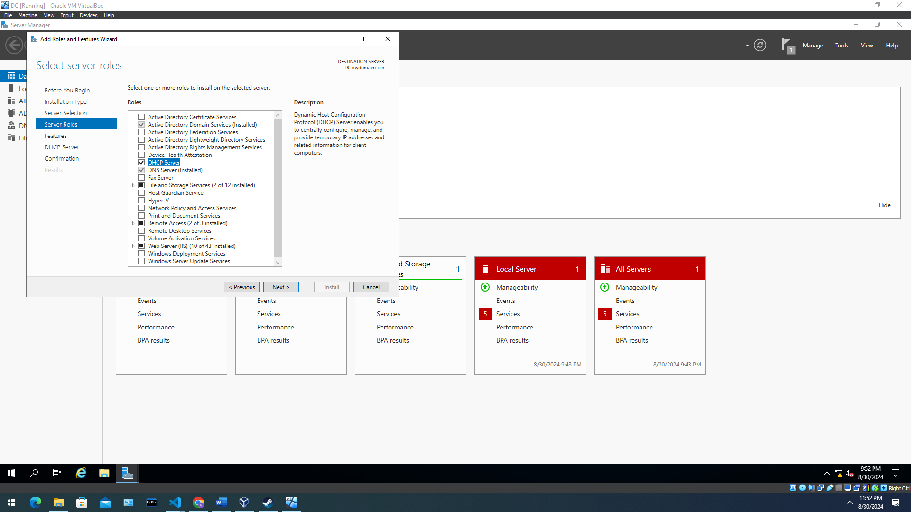

<h1>Active Directory</h1>


<h2>Description</h2>
This project uses active directory to create a domain controller and a client. Then it connects the client
<br />


<h2>Languages and Utilities Used</h2>

- <b>PowerShell</b>
- <b>Active Directory</b> 

<h2>Environments Used </h2>

- <b>Windows 10</b> (21H2)
- <b>Windows 2017</b> (21H2)

<h2>Program walk-through:</h2>

<p align="center">
Create a Domain Controller usings windows server 2019: <br/>

<br />
<br />
Mount the ISO file to the Virtual box:  <br/>

<br />
<br />
Log Into Domain Controller: <br/>

<br />
<br />
Inserted additions to CD image to have more responsivness:  <br/>

<br />
<br />
Searched network details to find internal and external networks  <br/>

<br />
<br />
Changed the internal networks IP address from APIPA to class B IP address:  <br/>

<br />
<br />
Set up installation for Domain Controller:  <br/>

<br />
<br />


 <br />
<br />
Created Admin Organizational Unit  <br/>

 <br />
<br />
Added user to the admin OU  <br/>

 <br />
<br />
Added user to the Domain Controller  <br/>

<br />
<br />
Used remote access role to add NAT <br/>

 <br />
<br />


 <br />
<br />
Setup for DCHP server <br/>

 <br />
<br />
Create new scope for DCHP server  <br/>

 <br />
<br />
Observe the wiped disk:  <br/>

 <br />
<br />
Observe the wiped disk:  <br/>

 <br />
<br />
Observe the wiped disk:  <br/>

 <br />
<br />
Observe the wiped disk:  <br/>

 <br />
<br />
Observe the wiped disk:  <br/>

 <br />
<br />
Observe the wiped disk:  <br/>

 <br />
<br />
Observe the wiped disk:  <br/>

 <br />
<br />
</p>

<!--
 ```diff
- text in red
+ text in green
! text in orange
# text in gray
@@ text in purple (and bold)@@
```
--!>
